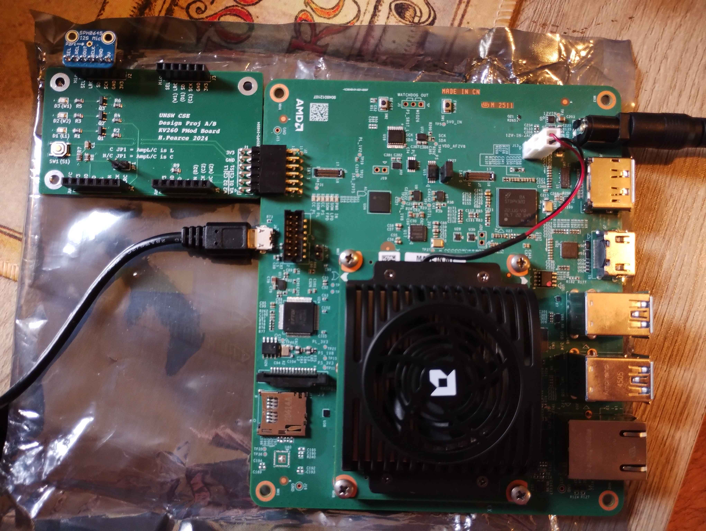
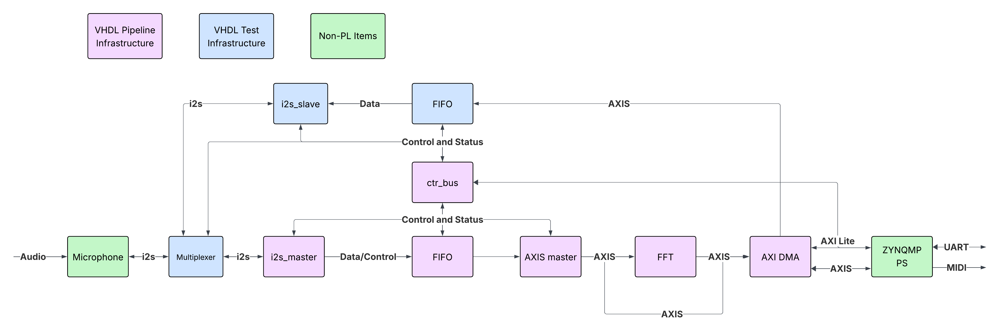
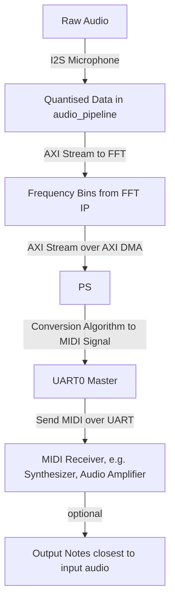
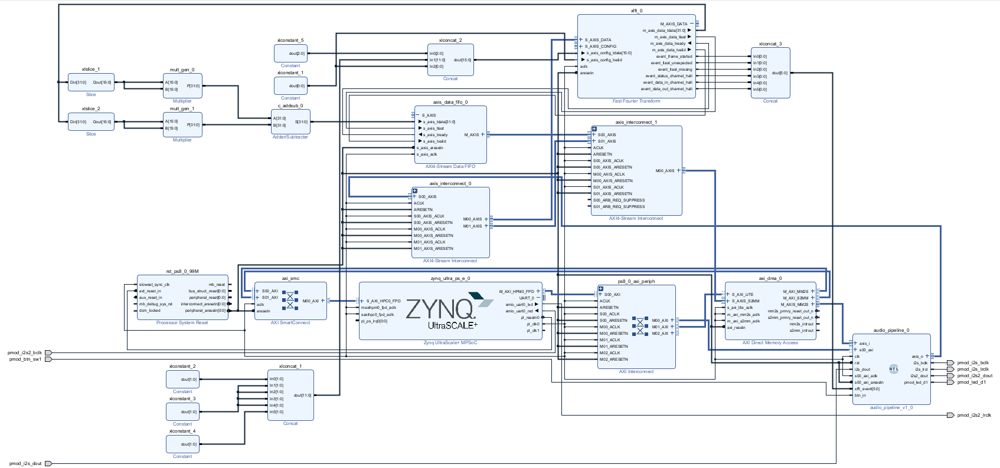
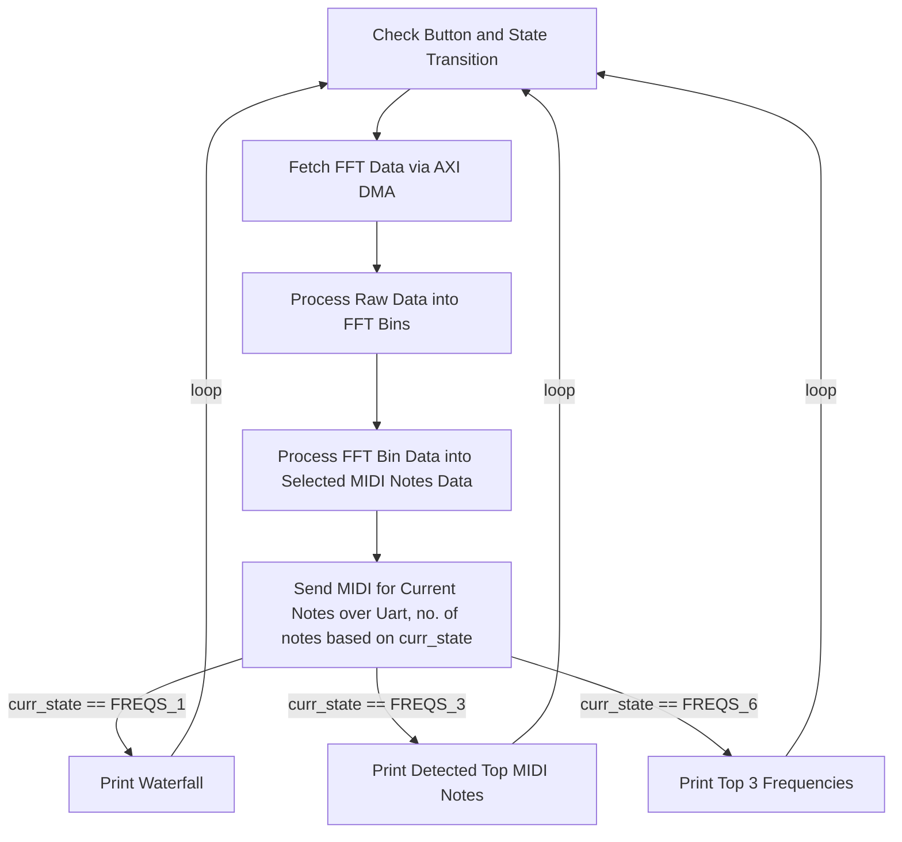
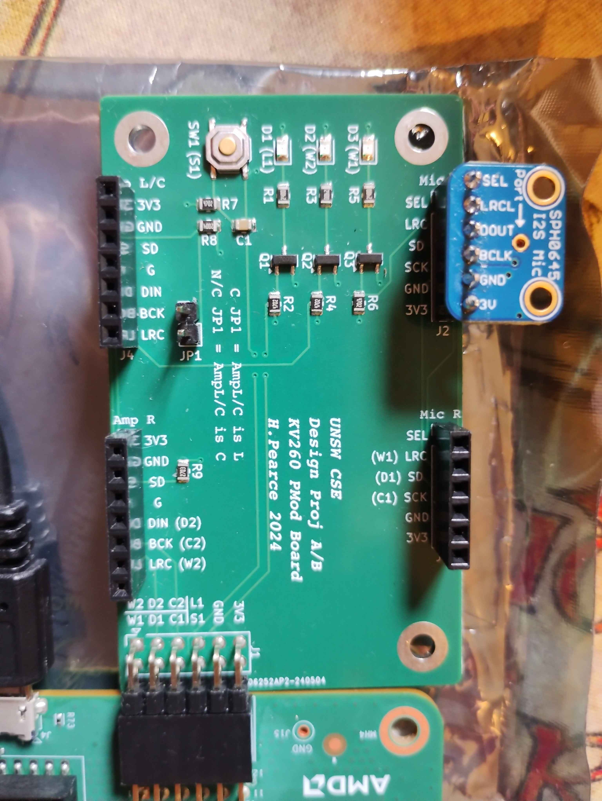
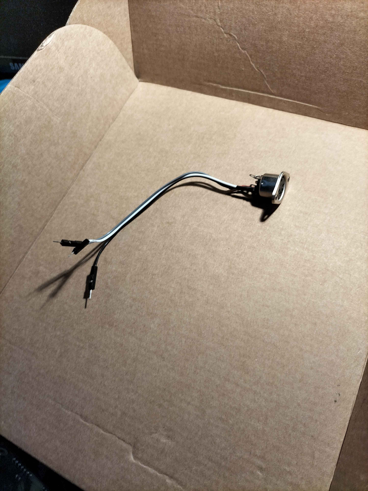
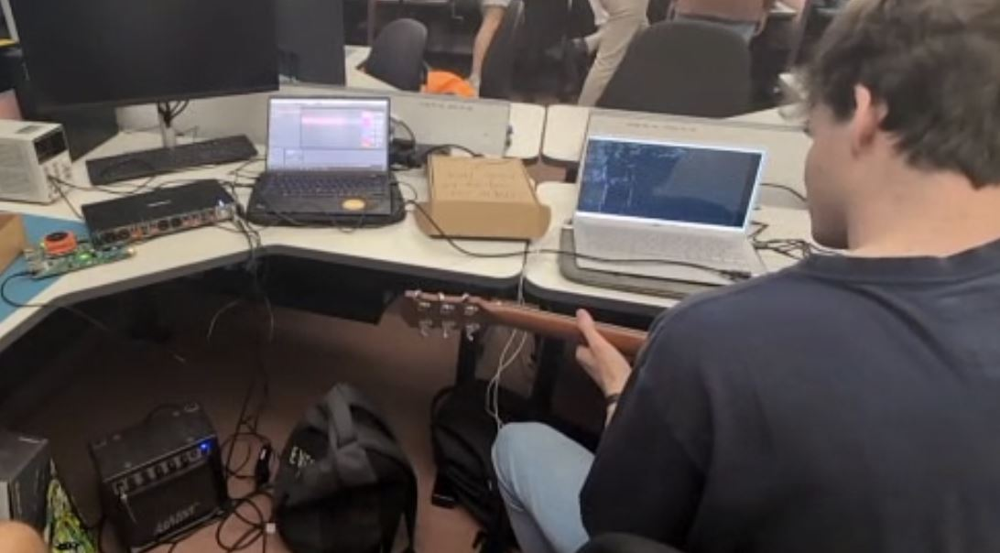
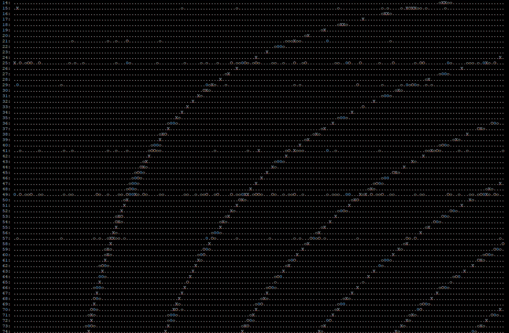

# COMP3601 Audio Project
## Audio to MIDI Converter (Group 12)

## Table of Contents
1. [Introduction](#1-introduction)
2. [File Organisation](#2-file-organisation)
3. [Explanation of Hardware](#3-explanation-of-hardware)
4. [Explanation of Software](#4-explanation-of-software)
5. [How to Run This Project](#5-how-to-run-this-project)

# 1 Introduction

This project was created by Aaron Nyholm (z5316510), Daniel Craig (z5417681) and Michael Benney (z5478530)

### 1.1 Project Overview
This repository contains the files for an audio to MIDI converter. This device takes in raw audio via I2S microphone (and even recorded audio data via AXI Stream into audio_pipeline), converts this into bins in the frequency domain using Xilinx's Fast Fourier Transform core, and outputs prominent notes within octaves 3-5 (130.81Hz - 987.77Hz) via the MIDI data standard.
This project is ran on the Xilinx Kria KV260 Vision AI Starter Kit. Attached to this is a specially designed PMod Board alongside a SPH0645 I2S Mic, allowing for I2S audio input into the KV260's PL. An image of the project board can be seen below.



### 1.2 MIDI Overview
MIDI is a data standard for electronic musical instruments and synthesizers to connect over a UART line of communication. A typical MIDI packet is 10 bits wide, with a start bit (low), 8 data bits and a stop bit (high), with MIDI transfers typically consisting of an instruction packet followed by an expected amount of data packets. Whilst there are many facets of the MIDI protocol, this project simply focuses on the transferral of data relating to turning on and off notes.

### 1.3 Internal Project Diagram


### 1.4 How Does this Project Integrate into a Wider System?



# 2 File Organisation
There are several VHDL source files which constitute the Vivado model of our hardware, these being `audio_pipeline.vhd`, `axis_master.vhd`, `axis_slave.vhd`, `ctrl_bus.vhd`, `fifo.vhd`, `i2s_master.vhd`, `i2s_slave.vhd` and `params.vhd`. All of these files should be included when constructing the project.
There are four testbenches included in the project. `fifo_TB.vhd` tests the fifo. `axis_TB.vhd` tests the AXI stream implementation. `i2s_slave_TB` and `i2s_master_TB` test the respective i2s controllers.

There is one C file, `freq_to_midi.c`, which holds our source code for the PS used in the Vitis project.

`xsas` holds prebuilt XSAs to allow for quick usage of the design. `audio_to_midi_24.xsa` is the latest build. You can confirm which version you are using by checking the version register.

# 3 Explanation of Hardware

### 3.1 Vivado Block Diagram


### 3.2 audio_pipeline Module

The audio_pipeline module of our design directly interacts with the i2s microphone via the pmod_i2s_dout, pmod_i2s_bclk and pmod_i2s_lrclk ports. 

In i2s_master.vhd, this raw data is captured from these i2s lines and stored in the FIFO (instantiated through fifo.vhd) for further transmission, with our sampling rate being 25201Hz. Moreover, we can configure which i2s channel (L/R/both) is accepted by the i2s_master in PS. 

Also configurable in the PS core, we can instead receive digital audio data through an axis slave with another attached FIFO (axis_slave.vhd). This instead causes the audio_pipeline to send the signal received by the axis slave to the FFT IP, which allows our system to output MIDI signals of recorded audio. When the system is receiving digital input, we have coded it so that pmod_led_d1 is switched on for immediate visual indication. 

Furthermore, we make use of status registers to observe the internal behaviour of the FIFOs and the FFT event signals. To check the behaviour of the submodules of audio_pipeline, we have test benches for both the i2s_master and the fifos.

Moreover, the pmod_btn_sw1 port has been wired into the MSB of the version register, allowing for the PS to read buttons to change states of the machine.

### 3.3 Xilinx Fast Fourier Transform IP
This raw data is then fed out of the audio pipeline module and into the xfft IP via AXI Stream. The data fed into AXI Stream is reduced from 32 bits to 15 bits wide, this is because the input to the xfft is comprised of two 16 bit signed numbers representing imaginary and real data (and so we reduce to 15 bits to ensure our real input doesn't experience sign changes)
In our case, we take the bits [28 downto 14] of audio_pipeline's axis_o_tdata since the microphone's resolution causes bits [13 downto 0] to always be zero, and we observed the dc offset of the data causing bits [31 downto 29] to be constant. For the xfft's S_AXIS_CONFIG input, we input the constant bit string x"0d57". This config input is split up as [15 downto 13] are padding zeroes, [12 downto 1] is the scaling schedule of the FFT (in our case, to avoid overflowing, our scaling schedule is [1 2 2 2 2 3]), and the LSB is '1' so that the FFT works in forward mode.
This FFT is of size 2048 which, coupled with our sampling frequency of 25201Hz, provides us with an output bin size of ~12Hz. We chose Pipelined Streaming I/O for the FFT's architecture to allow the audio pipeline to continually send data whilst the PS system purely interacts with the FFT using the axi dma. Under the implementation settings, we use fixed point scaled data, and ensure that the output is naturally ordered. The latency of this module is 62.730 us.

The output of this FFT is again carried via axi stream to AXI DMA IP. To save some data manipulation in the PS system, the output m_axis_data_tdata of the FFT is split into the real and imaginary parts, performing combinational calculations to ensure the input to the dma s_axis_s2mm_tdata = re^2 + im^2. Originally, a CORDIC IP block was also used to calculate the square root of that value, however the delay introduced caused issues so the square root function was allocated in responsibility to the PS.
This AXI DMA then acts as the interface by which, through an AXI SmartConnect module, the PS can extract data from the FFT. Moreover, the FFT has 6 event signals which describe what is happening within the block, these are fed into the audio_pipeline module to be added to the status register for reading from the PS.

### 3.4 UART0

Finally, in order to transmit our MIDI, we have enabled UART0 in the Zynq Ultrascale+ MPSoC IP, setting the I/O to EMIO which allows us to access the UART signal on the internal hardware lines. From this, we have attached emio_uart0_txd to the pmod_i2s2_lrclk pin and the (unused) emio_uart0_rxd to the pmod_i2s2_bclk pin.

### 3.5 Register Space

Register Base: `0xA0000000`

#### I2S control register:
**Offset:** 0x0

**Access:** RW

**Description:** Control I2S features.
| Bit  | Contents                               |
|------|----------------------------------------|
| 0    | Capture: 1 = Enable, 0 = Disable       |
| 1    | Left Channel: 1 = Enable, 0 = Disable  |
| 2    | Right Channel: 1 = Enable, 0 = Disable |
| 3-5  | Unused                                 |
| 6    | 1: Feedback System, 0: Use Mic Data    |
| 7-31 | Unused                                 |

#### FIFO status register:
**Offset:** 0x4

**Access:** RO

**Description:** FIFO statuses
| Bit   | Contents               |
|-------|------------------------|
| 31    | Feedback FIFO full     |
| 30    | Feedback FIFO empty    |
| 29-16 | Items in feedback FIFO |
| 15    | Data FIFO full         |
| 14    | Data FIFO empty        |
| 13-0  | Items in data FIFO     |

#### Version register:
**Offset:** 0x8

**Access:** RO

**Description:** Get version of PL image.
| Bit  | Contents               |
|------|------------------------|
| 0-31 | PL Image Version       |

#### AXI control register:
**Offset:** 0xC

**Access:** RW

**Description:** Control AXI Stream packet length and bypass.
| Bit  | Contents                                                                 |
|------|--------------------------------------------------------------------------|
| 0-30 | AXIS Packet Length. This should be set to 2048 while the FFT is enabled. |
| 31   | 1: Bypass FFT, 0: Enable FFT                                             |

#### General status register:
**Offset:** 0x10

**Access:** RO

**Description:** FFT and Button status.
| Bit  | Contents                  |
|------|---------------------------|
| 0    | FFT Frame started         |
| 1    | FFT TLAST unexpected      |
| 2    | FFT TLAST missing         |
| 3    | FFT Status channel halt   |
| 4    | FFT Data in channel halt  |
| 5    | FFT Data out channel halt |
| 6-30 | Unused                    |
| 31   | Button Pressed            |

#### AXIS master status register:
**Offset:** 0x14

**Access:** RO

**Description:** Status of AXIS master.
| Bit  | Contents                  |
|------|---------------------------|
| 31   | TVALID                    |
| 30   | TREADY                    |
| 29   | Initialised               |
| 28-0 | Data sent in packet count |


# 4 Explanation of Software

All of the project's software is contained within the freq_to_midi.c file.

### 4.1 Functions

- **`int main()`**
	The main function where execution begins, currently the data printing format is tied to **curr_state**

- **`void init_axi_dma()`**
	Initialises the AXI DMA for transferral of data between the PS and PL

- **`void print_regs()`**
	Prints the version, control and status registers from audio_pipeline module, allowing for debugging

- **`void fetch_fft_data()`**
	Completes an AXI DMA transfer of the FFT data into **rx_buf**

- **`void process_fft_data()`**
	Converts the data in **rx_buf** into the FFT bins in **fft_bins**

- **`void print_fft_data()`**
	Simply prints the first 200 bins' data alongside their corresponding frequencies (we are only really interested in the first 200 bins, although there are 2048 bins in total)

- **`void get_top_freqs()`**
	Prints the 3 frequencies with the highest bin magnitude between the 6th and 200th bins (we omit the first 5 bins due to large DC offset distorting this region)

- **`void print_waterfall()`**
	Prints a makeshift waterfall output using the frequencies of the first 180 bins and splitting them into relative quintiles

- **`void check_btn()`**
	Checks the MSB of the version register to see the value of the btn, if the button has been pushed then change the **curr_state**

- **`void check_freqs()`**
	Checks the pre-allocated bins (in **frequency_bins**) associated with our notes of interest and sort any notes which have a bin magnitude greater than **MIN_THRESHOLD** into the top 6 notes, converting the notes into their MIDI values with the **MIN_NOTE** offset 

- **`void transmit_midi()`**
	Sends MIDI signals over UART to turn off notes no longer found in the audio and turn on new notes which have popped up, with the number of notes transmitted being dictated by **curr_state**

- **`print_midi_master_input()`**
	Prints the (up to) top 6 notes detected in their MIDI value

- **`int initialise_uart(XUartPs* Uart_Ps, u16 DeviceId, int baud_rate)`**
	Initialises the UART0 line for transmission of MIDI

- **`int send_note(XUartPs* Uart_Ps, int note, int velocity)`**
	Sends a specified MIDI note over UART0, with velocity 0 turning a note off whilst other velocities specify how loud a given note is

### 4.2 Global Variables

AXI DMA related variables
- **XAxiDma_Config \*CfgPtr**
	The configuration pointer for the AXI DMA

- **XAxiDma AxiDma**
	Reference to the AXI DMA used in data transfers

- **volatile char rx_buf[BUF_SIZE]**
	Array which stores data received from AXI DMA

UART related variables
- **XUartPs Uart0_Ps**
	Instance of the UART0 driver

- **int curr_notes[6]**
	Array for the notes detected in the current batch of fft bins

- **int prev_notes[6]**
	Array for the previously detected notes, signifying those already active

State related variables
- **uint32_t prev_btn**
	Stores the previous value of button used in state updating

- **uint32_t curr_state**
	Stores the current state

Misc
- **uint32_t fft_bins[FFT_SIZE]**
	Bins corresponding to frequencies between 0Hz and 25kHz differing by 12Hz each, output of the fft

- **int frequency_bins[36]**
	Constant array for bin locations corresponding with each note

### 4.3 Execution Flow

When ran, the program first initialises both the AXI DMA and UART0 lines. After this, the program enters an indefinite loop of the form



# 5 How to Run This Project

### 5.1 Building Vivado Model

In this project, we used Vivado 2024.1's design suite to create a hardware implementation of our design.

```create_project.tcl``` has been created to build the project from scratch.
To use this script run the following in vivado's tcl console:
```
cd <path to your clone of this repo>
source create_project.tcl
```
The project will construct and build in the repo folder under `audio_to_midi_project`

**Exporting block design**
Any changes to the block diagram requires the `pl_audio_pipeline.tcl` to be updated. This can be done with the following: 
```write_bd_tcl -include_layout -force pl_audio_pipeline.tcl```

**Adding source files**
Any additional VHDL source files need to be added to `create_project.tcl`. This can be done by adding an add file line to to script.
The format is the following:
```add_files -norecurse ${repo_dir}/<filename>```

### 5.2 Building Vitis Platform and Project

In this project, we used Vitis Classic 2024.1 to realise the PS module of our design. When launching Vitis, create or use an existing workspace. Next, select `File>New>Platform Project`, and choose a sensible name for the platform. After this, either select the downloaded .xsa file from the repository, or use a .xsa generated from the Vivado project above. Leave all other options as default, and wait as the platform is created. 

An important step to enable ```print``` and ```printf``` statements in the serial terminal is to switch the stdin and stdout ports to uart1. To do this, click on the .spr file under the newly created platform. From this, under the 'standalone on psu_cortexa53' folder, click on `Board Support Package` and then on `Modify BSP Settings...`. On the next page, go to the `standalone` tab and change the values of stdin and stdout from psu_uart_0 to psu_uart_1. After this, click OK and then right click on the platform and select `Build Project`.

The next step after this is to select `File>New>Application Project`, select the just created platform when prompted to and name the project a sensible name. After this, leave `Domain` as default and press `Next`, then select the `Hello World` template. After this generates the project, go to the `src` directory and double click on `helloworld.c`, copy paste the entirity of the .c file in this repository into that file. After this, right click on the file that shares the project name (it is right under the [project name]_system file). Then select `C/C++ Build Settings`. On the pop-up, the default page should be `Settings`. In this settings page, navigate to `ARM v8 gcc linker/Libraries`. On this page, select `Add` (symbol to the write of `Libraries (-l)`) and then type `m` before pressing `Ok` and `Apply and Close`. Finally, build the project so that it is ready to run.

### 5.3 Running this Project

Once the Vitis Platform is built, we now need to connect the project board via the UART1 line from MIO36..37. This input is the USB-C Adapter on the Kria KV260 board. Once this is connected to our PC, we will want a Serial connection terminal to observe the print statements over UART1. With PuTTY (or a similar program), create a serial instance at the correct serial line with Baud Rate set to 115200. To confirm that the correct line has been chosen, press the reset button on the board and observe if the reboot messages are received in the terminal.

Next, we will need to set the board to JTAG mode. Our elected method of doing this is to use Xilinx XSCT 2024.1. Once open, enter into the terminal

```
proc boot_jtag { } {
############################
# Switch to JTAG boot mode #
############################
targets -set -filter {name =~ "PSU"}
# update multiboot to ZERO
mwr 0xffca0010 0x0
# change boot mode to JTAG
mwr 0xff5e0200 0x0100
# reset
rst -system
}
```
Finally, enter the commands `connect`, `boot_jtag` and `exit`. After this, the board is prepared for use. 

Next, press the `Run` command in the Vitis command bar. Then observe the serial terminal which, on startup, should have a waterfall generator (for best results, fullscreen the terminal). Pressing the button on the pmod Board will switch the output modes from Single Note, to Triple Notes, to Sextuple Notes and back to Single Note. The output in the serial terminal also depends on which mode of MIDI output the board is in, with Single Note corresponding to the waterfall generator, Triple Notes only displaying the transmitted MIDI values and Sextuple Notes displaying the most prominent detected frequencies between 60Hz and 2400Hz. If we wish to transmit the MIDI signal or simply observe the MIDI packets on an oscilloscope, we will need to connect to uart0_tx which corresponds to i2s2_lrclk on the pmod board, highlighted below alongside the +3V line and GND. Finally, if we wish to access other features (such as using digital audio input over raw audio input), then we must simply edit some lines in the C file and again press `Run`.



### 5.4 Integrating this project into a larger system

To integrate this project into a larger audio system, we need to create an adapter for the MIDI output. The form of such adapter depends on the device which we desire to connect our project to. When we demo-ed our project, the device we connected the our project to an Ableton live coming out of a guitar speaker. To do this, we created a modified DIN midi port (seen below) which connected to our design and adapted to a rubix44 interface for the Ableton.



As an example of how one could integrate our project into a system, our demo involved playing guitar into the microphone and playing back the MIDI notes using an Ableton and amplifier. Below is an image of this demonstration, contact us if you desire a video.



### 5.5 Running tests

To run tests set `feedback` to `1` in `freq_to_midi.c`. This will run through freqencies and you should see something like the following on the waterfall display.

